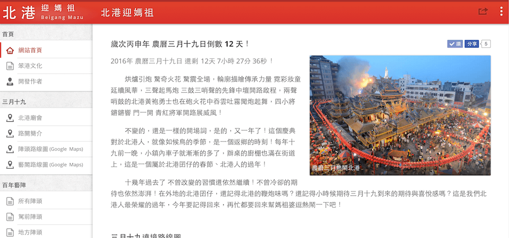

# 歡迎來到北港迎媽祖!
這是一個熱愛北港廟會活動的非營利網站，
主要希望能為地方古蹟、習俗活動帶來多一點的貢獻！
更希望大家參與北港廟會活動的同時，能更加的融入北港當地的文化。

---

 
## 範例演示
網站首頁，[北港迎媽祖](http://mazu.ioa.tw/)

 
## 聲明
* 本網站非官方網站，一切資訊以[北港朝天宮](http://www.matsu.org.tw/)官方公佈資訊為主。
* 本作品授權採用 姓名標示-非商業性 2.0 台灣 (CC BY-NC 2.0 TW) 授權，詳見 [http://creativecommons.org/licenses/by-nc/2.0/tw/](http://creativecommons.org/licenses/by-nc/2.0/tw/)

 
## 網站作者
* Facebook：[吳政賢](https://www.facebook.com/comdan66)
* GitHub：[comdan66 (OA)](https://github.com/comdan66)
* Web Sit：[OA's Resume.](http://www.ioa.tw/)
* Works：[OA Wu 的相關作品！](http://comdan66.github.io/)

 
## 作者感言
烘爐引炮 驚奇火花 驚震全場，
輪廓描繪 傳承力量 霓彩妝童 延續風華，
三聲起馬炮後三鼓三哨聲的先鋒中壇開路啟程，
兩聲哨鼓的北港黃袍勇士也在炮火花中吞雲吐霧聞炮起舞，
四小將鏗鏘響，門一開 青紅將軍開路展威風！

不變的，還是一樣的開場詞..
是的，又一年了。

「農曆三月十九」這個慶典對於北港人而言，就如候鳥一般，是一個返鄉的季節！
每年十九前一晚，小鎮內車子就漸漸的多了，辦桌的廚棚也滿在街道上，
這是一個屬於北港囝仔的春節、北港人的過年！

其實這一天對於北港人來說，不只是熱情也不僅僅是信仰，
更是一種習慣、參與感、責任感！

還記得，從國中時，自己去圖書館翻閱北港鎮地圖，
用紙筆 一筆一畫的將路關路線圖完成。
高中時，拿著人生第一台的數位相機，
記錄著每一年的活動，從起馬、唱班到落馬安座，
如今，終於可以用我所學的技能，來為我的故鄉做點什麼！

十幾年過去了，不曾改變的習慣還依然繼續！
不曾冷卻的期待也依然澎湃！
在外地的北港囝仔，還記得北港的鞭炮味嗎？
這一天這是我們北港人最榮耀、最團結的過年，
今年要記得回來，再忙都要回來幫媽祖婆逗熱鬧一下吧！

如果你不是北港人，
但對傳統文化有著興趣與熱誠，推薦你來北港參與一次吧！
你會看到的不只是陣頭鞭炮，而是整個鎮上參與的感動！

 
## 莫忘初衷
這是一個熱愛北港廟會活動的非營利網站，
主要希望能為地方古蹟、習俗活動帶來多一點的貢獻！
更希望大家參與北港廟會活動的同時，能更加的融入北港當地的文化。

網站出發點，其實單純的只想為北港媽祖三月十九繞境活動作宣傳，
若您個是熱愛在地文化的朋友們，那一定來參與這盛會！
若您是個道道地地的北港囝仔，那更可以將這個網站分享出去，
讓台灣所有人更可以看得到北港的美。

北港這個可愛以及迷人文化古鎮，
它擁有的不只印象中的宗教信仰中心
而是有著數多的百年藝陣、人文傳統、宗教信仰..等，
讓我們期許這小鎮特色的是能被記錄與看見！
無論文章或攝影，都一起來記錄吧！希望大家一起分享一起加油！

還是要說一下，
網站上面資料多數是參考網路上資源以及前輩們對於地方研究敘述的資料！
如要引用，請標明出處或告知原作者！
另外，若是網站內文章、資訊有錯誤或有不妥，
也歡迎各位來信指導、建議。
